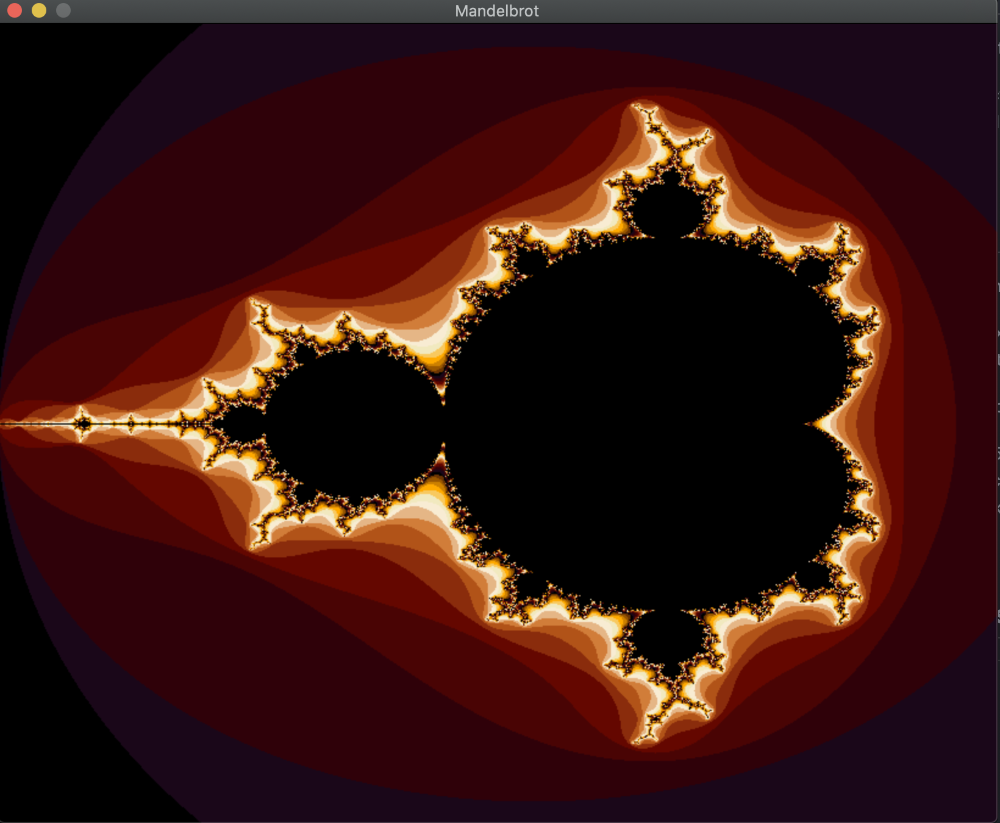

<!-- PROJECT SUMMARY -->

  

  <h3 align="center">fract-ol</h3>

  

    Summary:
    This project is about creating graphically beautiful fractals.
  

   

<!-- TABLE OF CONTENTS -->

- [About The Project](#about-the-project)
- [Usage](#usage)
- [Sources](#sources)

<!-- ABOUT THE PROJECT -->
## About The Project

This is the first graphical project of the 42 Cursus where we are introduced to the school graphical library: the MiniLibX.

This project allowed me to discover the utilization of complex numbers in programming as well as the optimization in computer graphics. It also interested me in event handling through the keyboard and the mouse.

(<a href="#readme-top">back to top</a>)

<!-- USAGE EXAMPLES -->
## Usage

Before launching the program you need to do a `make`.

After the executable named `fractol` is created you can execute it by providing the name of the fractal that you want to see.
The ones available are: the Mandelbrot set, the Julia set (Julia1, Julia2 and Julia3 to have different starting position) and the Burningship set.

All the keybindings are supported for a mac computer. It might not work depending on the configuration that you are using.

There are 5 colors set available, you can change between using the 1 to 5 digits.
You can reset the view by pressing on `R`.
You can move the view with the arrow keys.
You can change the number of iterations done in the calcul by pressing on `A/D`.
You can use the mouse to change some parameters in the Julia set. You can lock/unlock the mouse with `F`.
You can zoom with the mouse.

(<a href="#readme-top">back to top</a>)

<!-- SOURCES -->
## Sources
* For the fractals
  * https://lodev.org/cgtutor/juliamandelbrot.html
  * https://www.youtube.com/watch?v=iFA3g_4myFw
  * https://www.youtube.com/watch?v=-RdOwhmqP5s
  * https://users.math.yale.edu/public_html/People/frame/Fractals/MandelSet/welcome.html

* For the Mandelbrot set
  * https://www.youtube.com/watch?v=6z7GQewK-Ks
  * https://www.codingame.com/playgrounds/2358/how-to-plot-the-mandelbrot-set/mandelbrot-set
  * https://zestedesavoir.com/tutoriels/329/dessiner-la-fractale-de-mandelbrot/
  * https://www.youtube.com/watch?v=Y4ICbYtBGzA

* For the Julia set
  * https://www.youtube.com/watch?v=fAsaSkmbF5s
  * https://complex-analysis.com/content/julia_set.html
  * https://acko.net/blog/how-to-fold-a-julia-fractal/

* For the Burningship set
  * https://paulbourke.net/fractals/burnship/

* For the MiniLibX
  * https://harm-smits.github.io/42docs/libs/minilibx

* For the mac virtual keycodes
  * https://gist.github.com/eegrok/949034

(<a href="#readme-top">back to top</a>)

